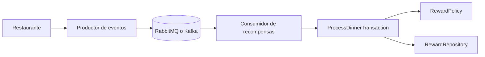

# Laboratorio 8 - Sistema de recompensas

Solucion orientada a eventos para procesar consumos realizados en restaurantes afiliados. El restaurante publica una transaccion en un broker de mensajeria y el sistema de recompensas consume ese evento para calcular puntos y cashback del cliente.

## Objetivo

El proyecto aplica principios de buen diseno de software:

- Modularidad por capas.
- Abstraccion de reglas de negocio mediante dominio y puertos.
- Bajo acoplamiento entre negocio e infraestructura.
- Alta cohesion dentro de cada modulo.
- Pruebas automatizadas con reporte de cobertura.
- Analisis estatico con SonarQube.

## Arquitectura

Se implementa una arquitectura hexagonal orientada a eventos. La logica de negocio no depende de RabbitMQ, Kafka ni librerias externas; esas dependencias se ubican en la capa de infraestructura.

```text
src/rewards/
  application/      Casos de uso y puertos
  common/           Configuracion y serializacion de eventos
  domain/           Entidades y reglas de negocio
  infrastructure/   Repositorios y adaptadores RabbitMQ/Kafka
  services/         Entrypoints de ejecucion
tests/              Pruebas unitarias
```

## Flujo Principal

1. El restaurante registra una cena.
2. El productor publica un evento con monto, tarjeta, restaurante y fecha.
3. RabbitMQ o Kafka entrega el evento al consumidor.
4. `ProcessDinnerTransaction` calcula la recompensa.
5. El repositorio guarda el resultado procesado.



## Evento de Transaccion

```json
{
  "amount": "120.50",
  "card_number": "4556737586899855",
  "restaurant_code": "REST-UTEC-01",
  "occurred_at": "2026-05-16T20:30:00+00:00"
}
```

## Variables de Entorno

Las variables necesarias estan documentadas en `.env.example`. El archivo `.env` real no debe subirse al repositorio.

Variables principales:

- `RABBIT_PASSWORD`: password de RabbitMQ entregado por el curso.
- `KAFKA_BOOTSTRAP_SERVERS`: servidor Kafka.
- `SONAR_TOKEN`: token para ejecutar SonarQube.

## Instalacion

```powershell
python -m pip install -r requirements.txt
```

## Pruebas y Cobertura

```powershell
$env:PYTHONPATH="src"
python -m coverage run -m unittest discover -s tests
python -m coverage report
python -m coverage xml
```

La configuracion de `.coveragerc` excluye adaptadores externos y entrypoints porque dependen de brokers reales. La cobertura se concentra en dominio, casos de uso, serializacion y repositorio.

## Ejecutar con RabbitMQ

En una terminal:

```powershell
$env:PYTHONPATH="src"
$env:RABBIT_PASSWORD="<password_del_curso>"
python -m rewards.services.main rabbit-consumer
```

En otra terminal:

```powershell
$env:PYTHONPATH="src"
$env:RABBIT_PASSWORD="<password_del_curso>"
python -m rewards.services.main rabbit-producer
```

## Ejecutar con Kafka

En una terminal:

```powershell
$env:PYTHONPATH="src"
python -m rewards.services.main kafka-consumer
```

En otra terminal:

```powershell
$env:PYTHONPATH="src"
python -m rewards.services.main kafka-producer
```

Si el servidor Kafka cambia, configurar:

```powershell
$env:KAFKA_BOOTSTRAP_SERVERS="213.199.42.57:9092"
```

## SonarQube

Generar cobertura y ejecutar el analisis:

```powershell
$env:PYTHONPATH="src"
$env:SONAR_TOKEN="<token_del_curso>"
python -m coverage run -m unittest discover -s tests
python -m coverage xml
sonar-scanner
```
